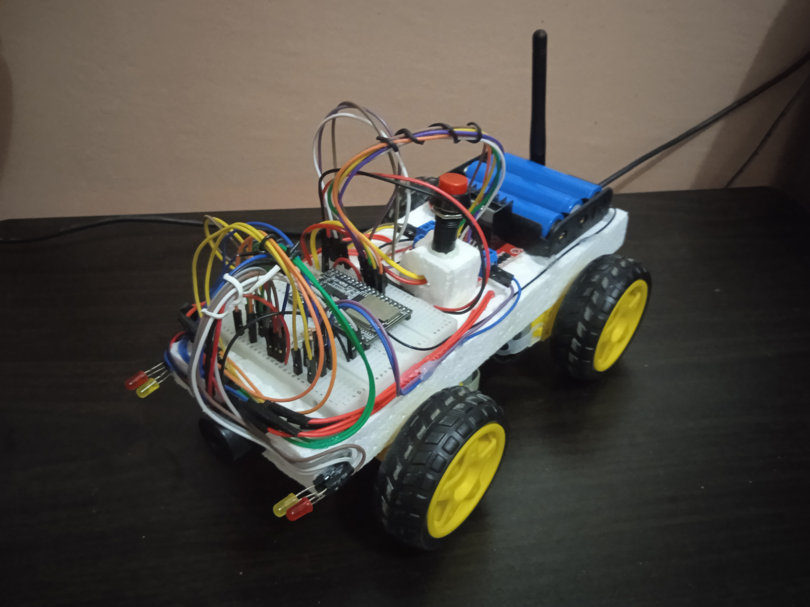

# About

This remote-controlled four wheel car system is equipped with four powerful DC motors that can be controlled via an Android application installable on most Android devices. The car establishes a Wi-Fi access point, then it creates a TCP socket server on port 8080. The Android application connects to that Wi-Fi access point and to the TCP socket server. The car listens and executes commands sent by the Android application. The Android applicaton can control the direction of the car and adjust the speed of the DC motors. The Android application also uses the SpeechRecognizer API to convert speech input into commands executable by the car which allows the car to be controlled by voice input.

## Functions

- Automatic acceleration
- 4-speed selection
- Voice input command
- Horn function
- LED headlights
- LED signal lights
- LED hazard lights
- Switch to turn ON/OFF the car

## Materials Used

- 4 TT Gear DC Motors
- ESP32 with detachable antenna
- L298n motor driver
- 3x 5800mah 18650 3.7v Lithium-ion battery
- 3 slot battery holder for 18650 batteries
- Jumper wires
- Bread board
- 4x LED lights
- Buzzer
- ON/OFF switch
- Styrofoam

## Four wheels remote controlled car

The source code for the remote control car can be found [here](https://github.com/johndeweyzxc/Remote-Control-Car)

    

## Android application control panel

    

## Abbreviations

- HL - Headlights
- RTV - Realtime Voice
- SL - Signal Left
- SR - Signal Right
- H - Horn
- B - Break
- N - Neutral
