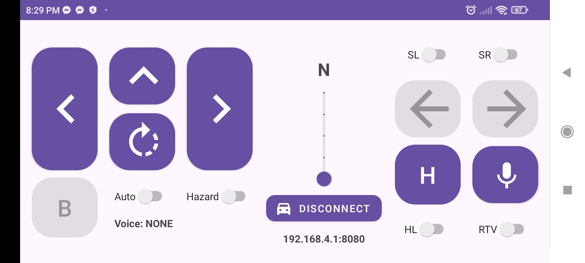

# Remote Control Car Controller

Provides user interface and connects to the car server to transmit commands. The car processes and executes these commands. Notably, the Android application leverages the SpeechRecognizer API to convert speech input into actionable commands executable by the car which allows the car to be controlled by voice input.

    

### Abbreviations

- HL - Headlights
- RTV - Realtime Voice
- SL - Signal Left
- SR - Signal Right
- H - Horn
- B - Break
- N - Neutral
